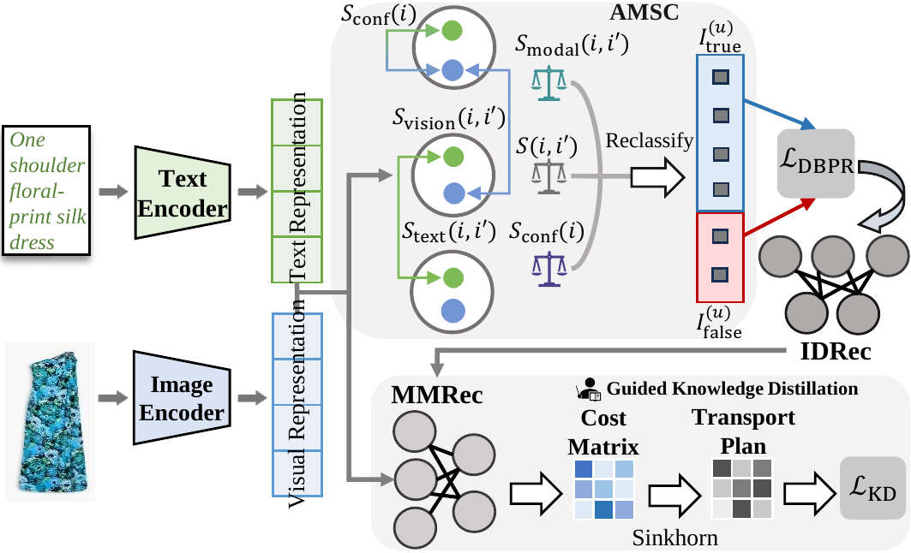

# Teach Me How to Denoise: A Universal Framework for Denoising Multi-modal Recommender Systems via Guided Calibration


## Introduction

This is the Pytorch implementation for our WSDM 2025 paper:
> **[WSDM 2025]** Hongji Li, Hanwen Du, Youhua Li, Junchen Fu, Chunxiao Li, Ziyi Zhuang, Jiakang Li, Yongxin Ni (2025). *Teach Me How to Denoise: A Universal Framework for Denoising Multi-modal Recommender Systems via Guided Calibration*  
> *WSDM '25: Proceedings of the Eighteenth ACM International Conference on Web Search and Data Mining*, Pages 782–791  
> [https://doi.org/10.1145/3701551.3703507](https://doi.org/10.1145/3701551.3703507)  
> 


## How to run
1. Place the downloaded data (e.g. `baby`) into the `data` directory.
2. Enter the `src` folder and execute the following command:  
`python main.py -m SMORE -d baby`  


## Citation
If you find Guider useful in your research, please consider citing our [paper](https://dl.acm.org/doi/abs/10.1145/3701551.3703507).
```
@inproceedings{li2025teach,
  title={Teach Me How to Denoise: A Universal Framework for Denoising Multi-modal Recommender Systems via Guided Calibration},
  author={Li, Hongji and Du, Hanwen and Li, Youhua and Fu, Junchen and Li, Chunxiao and Zhuang, Ziyi and Li, Jiakang and Ni, Yongxin},
  booktitle={Proceedings of the Eighteenth ACM International Conference on Web Search and Data Mining},
  pages={782--791},
  year={2025}
}
```
This code is made available solely for academic research purposes.


## Acknowledgement
The structure of this code is inspired by the [MMRec](https://github.com/enoche/MMRec) framework. We acknowledge and appreciate their valuable contributions.
